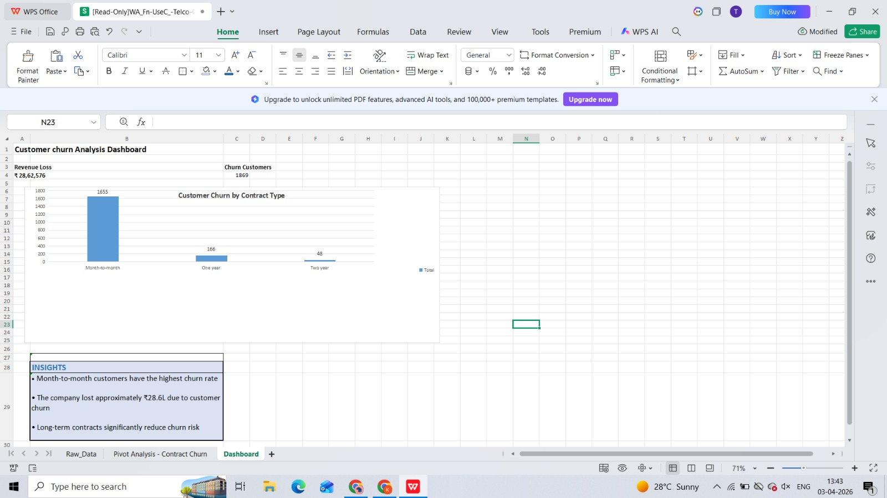

 # 📊 Customer Churn Analysis Dashboard
 
 An interactive Excel dashboard analyzing customer churn patterns, revenue loss, and contract-based risk factors.
 

  

## 🔍 Project Overview

This project analyzes customer churn behavior using Excel and provides actionable insights into customer retention and revenue impact.
## 📁 Dataset

* Telco Customer Churn Dataset (~6000 records)

## 📁 Files

- 📄 **Customer_Churn_Analysis.xlsx** – Main dashboard file  
- 🖼️ **dashboard.png** – Dashboard preview
  
## 🛠 Tools Used

* Microsoft Excel / WPS Office
* Pivot Tables
* Pivot Charts

## 📈 Key Insights

- Customers with month-to-month contracts exhibit the highest churn rate
- Estimated revenue loss due to churn is ₹28.6 Lakhs
- Long-term contracts significantly reduce churn risk
 
  ## 🚀 How to Use

- Open the Excel file
- Navigate to the Dashboard sheet
- Use filters (Contract, Payment Method, Internet Service)
- Analyze churn trends and revenue loss

 ## 🛠 Skills Demonstrated

- Data Analysis
- Excel Pivot Tables
- Data Visualization
- Dashboard Design
  
## 📊 Dashboard Features

* Churn distribution by contract type
* KPI metrics (Total churn customers, Revenue loss)
* Interactive filters (Pivot-based)

## 🚀 Outcome
This dashboard helps identify high-risk customers and supports business decisions to reduce churn and revenue loss.

## ⭐ Future Improvements

- Add predictive churn model (ML)
- Automate dashboard using Python/Power BI
- Deploy as web-based dashboard
